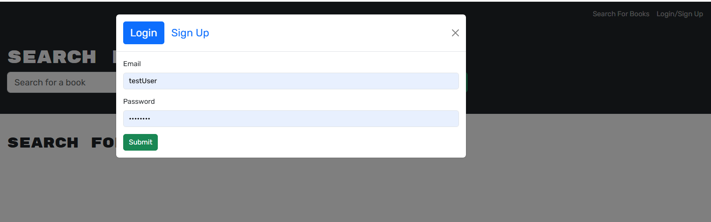

# Book Search Application using Google API

This is a full-stack application that allows users to search for books using the Google Books API, save books to their profile, and manage their saved books. The application is built using the MERN stack (MongoDB, Express.js, React, Node.js) and uses GraphQL for API queries and mutations.


## Installation ### 

### 1. Clone the Repository

```bash
git clone git@github.com:jesseswanton/google-books.git
```
### 2. Create a .env file in the root directory of the server project with the following variables:
```bash
MONGODB_URI=your-mongo-db-uri
JWT_SECRET=your-jwt-secret
```

### 3. Use npm install in your client and server folders.

### 4. Use npm develop in your root folder to run the client and server concurrently.

## Usage
Sign up to create a new account or log in.



Use the search bar to find books by title. The results are fetched from the Google Books API.


Save Books: When logged in, you can save books to your profile by clicking the "Save this Book" button.


View Saved Books: Navigate to the "Saved Books" page to view your saved books and delete any books you no longer want in your library.


## GraphQL Endpoints

Queries:

me: Fetches the logged-in user's data and their saved books.

Mutations:

addBook(bookInput: BookInput): Saves a book to the user's library.

removeBook(bookId: ID!): Removes a book from the user's library.
